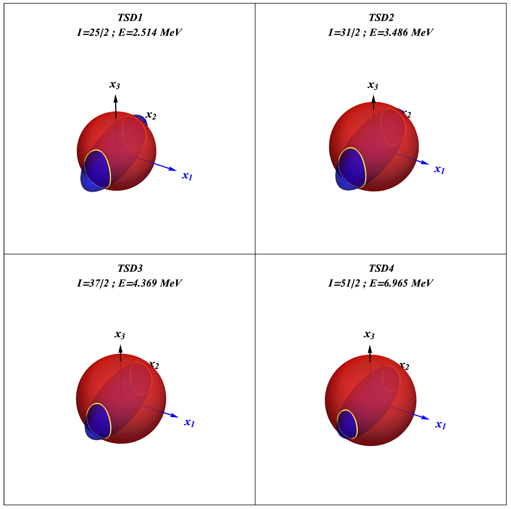

# Surface Intersection in Wolfram Mathematica

Calculates the intersection of two 3D surfaces. The intersection line is represented on the same space.

The energy ellipsoid is calculated by changing the expression fo the energy function $\mathcal{H}$ from the spherical coordinates $\theta,\varphi$ to the cartesian coordinate system: $x_1,x_2,x_3$.

Calculations are done in [this file](Lu167-EnergyEllipsoid/Resources/Lu_163_EnergyEllipsoid.pdf).

## $^{163}$Lu - Graphical representation for the rotational ellipsoid

The 3D figures are created within Mathematica, using `ContourPlot3D` function. The parameters used in the calculations are the moments of inertia, the total angular momentum of the system and the single-particle angular momentum (i.e. $A_1,A_2,A_3,I,j$). Current calculations are made for the fit parameters that correspond to the $^{163}$Lu isotope (results obtained in [this project](https://github.com/basavyr/163Lu-New-TSD4-Formalism).)

